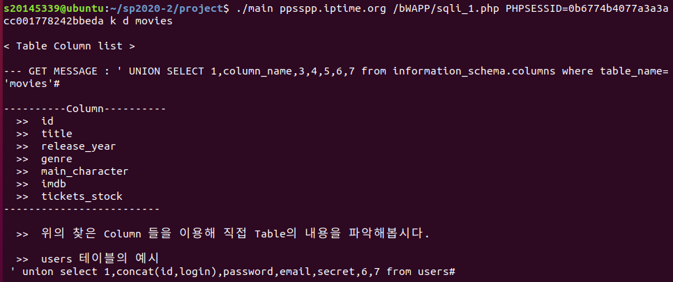
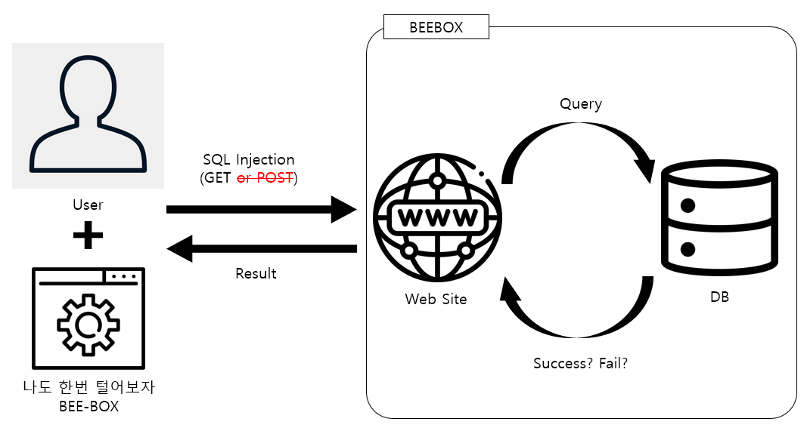
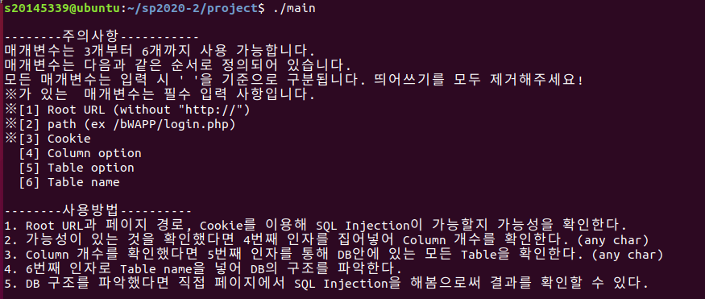
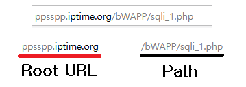
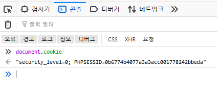
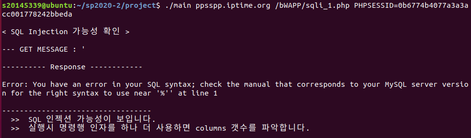
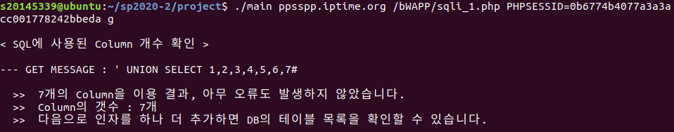
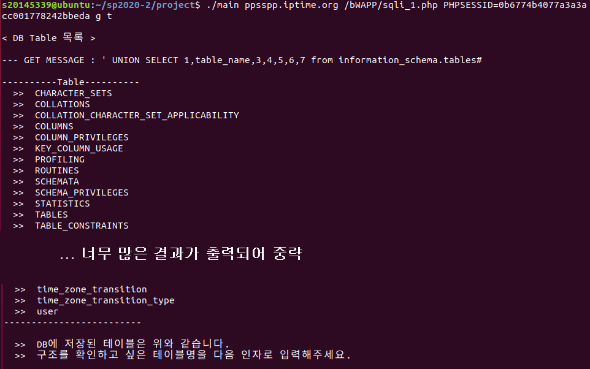
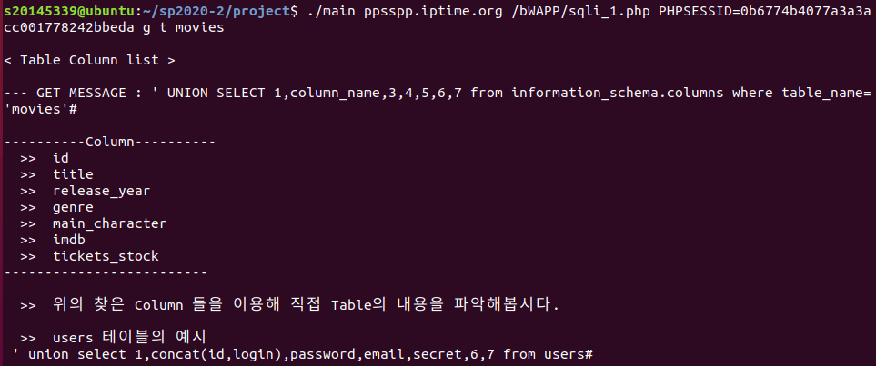

# 시스템프로그래밍 텀프로젝트

## A. 프로젝트 명

나도 한번 털어보자 BEE-BOX!
  

## B. 프로젝트 멤버

전병준 : 팀장 및 개발 등등... 1인 개발
  

## C. 프로젝트 소개 및 개발 내용 소개

웹 해킹을 해볼 수 있는 환경을 제공해주는 가상머신 이미지 Bee-box에 준비되어 있는 문제를 자동으로 풀어보는 프로그램
  

## D. 프로젝트 개발 결과물 소개

[최종 결과물] 

리눅스 실행파일이 하나 만들어지게 된다.  
최종적으로 SQL Injection을 이용해 Table의 Column까지 확인해볼 수 있다. 
그 이후에 해보고 싶은 문제는 직접 홈페이지에서 해야한다... (기술력의 한계)

  

[다이어그램] 

프로그램은 다음과 같은 흐름으로 동작한다.

유저는 '나도 한번 털어보다 BEE-BOX'를 이용해 웹사이트에 SQL Query를 조작하는 형태로 HTTP GET 메세지를 보낸 다음, 결과를 받는 단순한 구조로 동작한다.

기술력의 한계로 POST 메세지는 구현하지 못 했다...

  

## E. 개발 결과물을 사용하는 방법

1. 프로그램을 아무 인자도 없이 실행하면 주의사항과 실행방법에 대한 안내문이 나온다.
2. 안내문에 따라 Root URL, Path, Cookie를 설정해 프로그램을 실행한다.

 
<Root URL과 Path에 대한 설명>  
 
<Cookie를 구하는 방법>  

3. 명령행 인자로 주어야하는 url과 path, cookie는 다음과 같은 방법으로 쉽게 찾을 수 있다. 여기서 주의해야 할점은 cookie는 PHPSESSID 만을 이용해야한다. (구현의 한계...)

4. 명령행 인자에 필요한 인자들을 다 넣으면 다음과 같이 SQL Injection 가능성을 파악하는 작업부터 실행한다. "GET MESSAGE"는 해당 페이지에 Input에 작성한 값을 생각하면 된다.

5. 마지막 줄에 주어진대로 인자를 하나 늘리면 해당 SQL 문에서 사용한 Column 개수를 확인할 수 있다. 마찬가지로 인자를 하나 더 늘려 실행시켜보자.

6. 인자를 다시 늘려 실행하면 다음과 같이 DB에 저장된 테이블명을 확인 할 수 있다. 다음 인자로 테이블명을 넣어 실행시켜보자.

7. 해당 테이블이 어떤 Column으로 되어있는지 테이블의 구조를 확인할 수 있다. 이번 경우는 movies 테이블을 확인해보았다.
8. 이제 주어진 과정은 모두 끝났으니 직접 홈페이지에서 SQL Injection을 해보면서 놀면 된다.

  

## F. 개발 결과물의 필요성 및 활용방안

간접적으로 나마 SQL Injection을 체험해봄으로써 정보보안에 흥미를 가질 수 있는 도구로 활용될 수 있다.

  

## G. 아쉬운 점

SQL Injection 자동화 도구로 만들고 싶었으나, 기술력이 부족해 모든 정보를 안다는 전제로 만들어 다른 페이지에서는 전혀 활용할 수 없다. 오직 'sqli_1.php' 페이지에서만 활용 할 수 있다.

  

## 참고자료

Beebox 공격과정 : https://manpd.tistory.com/272

strtok : https://dojang.io/mod/page/view.php?id=376

substring 함수 구현 : https://blog.naver.com/cch2039/90144196231
